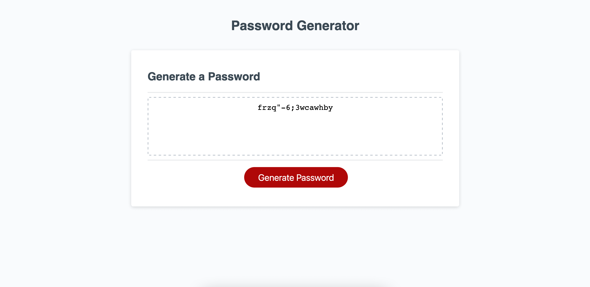

# About "Password Generator"

## Background

In the third graded homework assignment students are provided with HTML and CSS styling for a "Password Generator" page and students must write the JavaScript (JS) code to create functionality for generating a random password that must include one, many or all of the following user specified criteria:

* Include lowercase alphabetic characters
* Include uppercase alphabetic characters
* Include numeric characters
* Include special characters (*as defined by the [OWASP Foundation](https://owasp.org/www-community/password-special-characters)*)

Students will use JS to prompt the user to define

* Desired number of characters in the final password
* Inclusion or exclusion of the four password criteria

These definitions must then be used to generate a random password that includes the user specified criteria for characters included in the makeup of the password.

### Requirements

1. Button must be used to initiate password generation
2. User is prompted with password criteria:
    * Length of password
        - Length of password is between 8 and 128 characters
    * Inclusion or exclusion of lowercase alphabetic characters
    * Inclusion or exclusion of uppercase alphabetic characters
    * Inclusion or exclusion of numeric characters
    * Inclusion or exclusion of [Special Characters](https://owasp.org/www-community/password-special-characters)
    * *All prompts are validated*
  
3. Password is generated with random characters matching user defined criteria
4. Password is displayed on the page or in an alert

### Desired End Product

## Design

### JavaScript Elements Used

In this project the following JavaScript elements and techniques were implemented:

* functions
* writing to `console.log`
* scope
* `for` loops
* `while` loops
* [`nullish coalescing operation`](https://developer.mozilla.org/en-US/docs/Web/JavaScript/Reference/Operators/Nullish_coalescing_operator)
* `Math.random()` method

### Key Design Features

* Users are instructed to enter "y" or "n" characters in prompts for "Yes, include" or "No, don't include," respectively.  Application accomodates uppercase entry of these characters
* If a user skips a prompt for password criteria, it is handled as if the user typed "n"
* Randomized characters match criteria specified by user, but frequency of different character types inserted in the password string are also randomized for better distribution of multiple character types
* Password is removed from screen when page is refreshed or user clicks password generate button
* Console Log messages are used to displayed user's selected password criteria to accomodate ease of testing

### Future Enhancement Requests

* Add a "Copy Password" button that will copy the password to the screen
* Improve `while` loop behavior
* Migrate prompts and alerts from dialog boxes to displayed on pages leading up to password generation

## Submission

Final work on assignment can be found at the following locations:

* **GitHub**:  [`password-generator` Repository](https://github.com/monstertruckdog/password-generator)
* **GitHub > GitPages**:  [Hosted assignment submission](https://monstertruckdog.github.io/password-generator/)